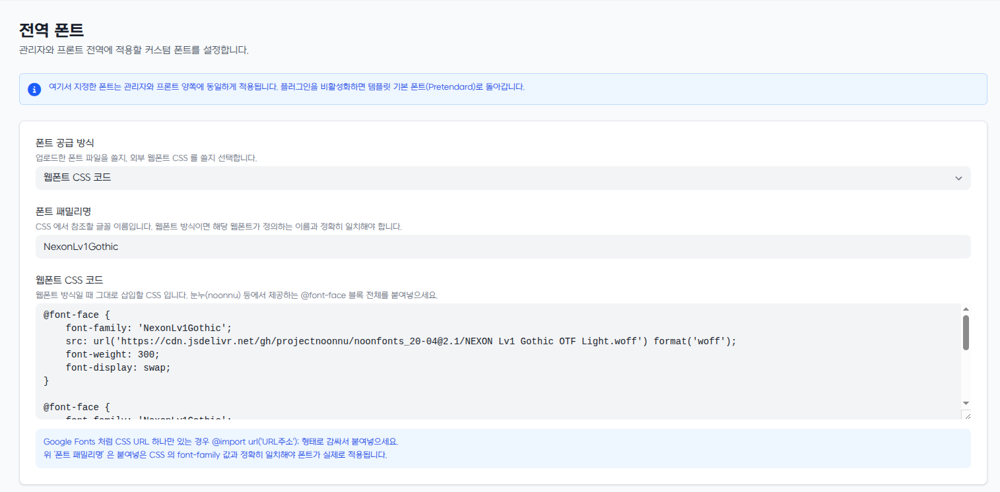

# g7-global-font

[](https://github.com/William1607cho/g7-global-font/releases)
[](./LICENSE)

A [Gnuboard7](https://github.com/gnuboard/g7) plugin that applies **one custom font
across the entire site — admin and front-end alike** — without touching any template
source.

한국어 안내는 아래 [사용법](#사용법-한국어) 절을 참고하세요.

---

## How it works

Gnuboard7's default admin and user templates are built separately, but both declare
the same Tailwind v4 `--font-sans` token. This plugin hooks the core
`core.assets.custom_assets` filter to inject a single generated stylesheet
(`/api/plugins/g7-global-font/font.css`) on every page, which redefines:

```css
:root { --font-sans: '<your font>', <original fallback stack>; }
```

Because that token flows into `--default-font-family` (and therefore `html`) and every
`font-sans` utility, one rule is enough to cover both the admin and the front-end.
Deactivating the plugin stops the filter from firing, so the site reverts to its
default font on its own.

## Requirements

- Gnuboard7 `>= 7.0.10`
- PHP `>= 8.2`

## Installation

### From GitHub (CLI)

```bash
cd /path/to/gnuboard7/plugins

# a release tag (recommended)
curl -L https://github.com/William1607cho/g7-global-font/archive/refs/tags/v1.0.2.tar.gz | tar xz
mv g7-global-font-1.0.2 g7-global-font

# ...or the latest main
git clone https://github.com/William1607cho/g7-global-font.git

# then, from the Gnuboard7 root:
cd ..
php artisan extension:update-autoload
php artisan plugin:install g7-global-font
php artisan plugin:activate g7-global-font
```

> If the font does not apply after activation, run
> `php artisan extension:update-autoload` once more — it rebuilds the cached hook map
> so the plugin's `core.assets.custom_assets` listener is registered.

### From the admin UI

Download a zip of a
[release](https://github.com/William1607cho/g7-global-font/releases) (or the repo) and
install it via **Admin → Plugins → Install → file upload**. The zip's top-level folder
must be named `g7-global-font`.

## Usage

Open **Admin → Plugins → Global Font → Settings**
(`/admin/plugins/g7-global-font/settings`).

### Font source: Upload

1. Set **Font source** to *Upload font file*.
2. Enter a **Font family name** (any name you like — it is what `--font-sans` will use).
3. Choose an `.otf` / `.ttf` / `.woff` / `.woff2` file (max 10 MB) and press **Upload font**.
   The file's contents must match its extension (the first bytes are checked for the
   WOFF2 / WOFF / TrueType / OpenType signature); a file that was merely renamed is rejected.
   The Apple `true` and TrueType Collection `ttcf` variants of `.ttf` are accepted by the
   signature check but have not been verified with real font files.
4. Press **Save**. The font is now applied everywhere.

### Font source: Webfont CSS

1. Set **Font source** to *Webfont CSS code*.
2. Enter the **Font family name** — it **must exactly match** the `font-family` value
   in the CSS you paste, or the font will not apply.
3. Paste the webfont CSS. Two common cases:

   **A font service that gives you an `@font-face` block** (e.g. [눈누 / noonnu](https://noonnu.cc)):

   ```css
   @font-face {
       font-family: 'NexonLv1Gothic';
       src: url('https://cdn.jsdelivr.net/gh/projectnoonnu/noonfonts_20-04@2.1/NEXON Lv1 Gothic OTF.woff') format('woff');
       font-weight: normal;
       font-display: swap;
   }
   ```

   **A service that only gives you a CSS URL** (e.g. Google Fonts) — wrap it in `@import`:

   ```css
   @import url('https://fonts.googleapis.com/css2?family=Noto+Sans+KR&display=swap');
   ```

4. Press **Save**.

The pasted CSS is served verbatim (an `@import` is placed first so it stays a valid
stylesheet rule), followed by the `--font-sans` override.

### Fallback behaviour

The site keeps rendering normally in every failure case:

| Situation | Result |
| --- | --- |
| No font configured | Default font (no override emitted) |
| Webfont CSS empty | Default font |
| Webfont URL / `@import` fails to load | Browser skips the missing family → default font |
| Font family name ≠ the `font-family` in the CSS | Browser cannot resolve the family → default font |

### Uninstall / deactivate

Deactivating removes the override immediately. Uninstalling also drops the plugin's
table (`g7_global_font_files`) and removes uploaded font files.

## Screenshots

The admin settings screen (**Admin → Plugins → Global Font → Settings**) in
webfont-CSS mode — font source selector, font family name, and a CSS textarea for
pasting an `@font-face` block, with hints for the Google Fonts `@import` wrap and the
family-name match requirement:



In *Upload* mode the CSS textarea is replaced by a file picker and an *Upload font*
button.

## <a name="사용법-한국어"></a>사용법 (한국어)

**관리자 → 플러그인 → 전역 폰트 → 설정** 으로 이동합니다.

- **폰트 파일 업로드**: 패밀리명을 입력하고 `otf/ttf/woff/woff2` 파일(최대 10MB)을 올린 뒤 저장.
  파일 내용이 확장자에 맞는 폰트 형식인지 확인하므로, 확장자만 바꾼 파일은 올라가지 않습니다.
  `.ttf` 의 Apple `true`/`ttcf` 형식은 실물 파일로 검증하지 않았습니다.
- **웹폰트 CSS 코드**: 패밀리명을 입력하고, 눈누 등에서 제공하는 `@font-face` 블록 전체를
  붙여넣거나, Google Fonts 처럼 CSS URL 하나만 있으면 `@import url('주소');` 형태로 감싸서
  붙여넣은 뒤 저장. **패밀리명은 붙여넣은 CSS 의 `font-family` 값과 정확히 일치해야** 합니다.

폰트가 비어 있거나, CSS 가 로드되지 않거나, 패밀리명이 CSS 와 다르면 자동으로 사이트 기본
폰트로 폴백합니다. 플러그인을 비활성화하면 즉시 원래 폰트로 돌아갑니다.

## Acknowledgments

The plugin skeleton follows the standard Gnuboard7 extension patterns. Its structure
was informed by SIRSOFT's MIT-licensed Gnuboard7 plugins
(`sirsoft-ckeditor5`, `sirsoft-daum_postcode`) as a reference for how a plugin wires
into the core (`AbstractPlugin`, `BasePluginServiceProvider`, hook listeners,
declarative settings layouts). No source code from those plugins is included here.

## License

[MIT](./LICENSE) © 2026 William Cho
